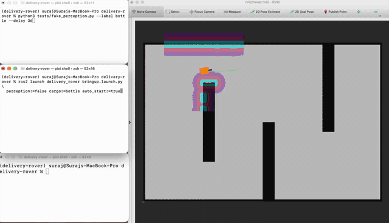
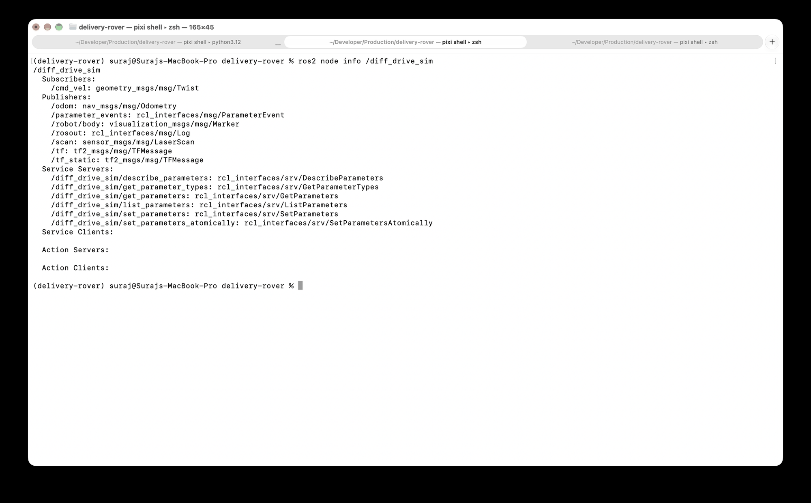
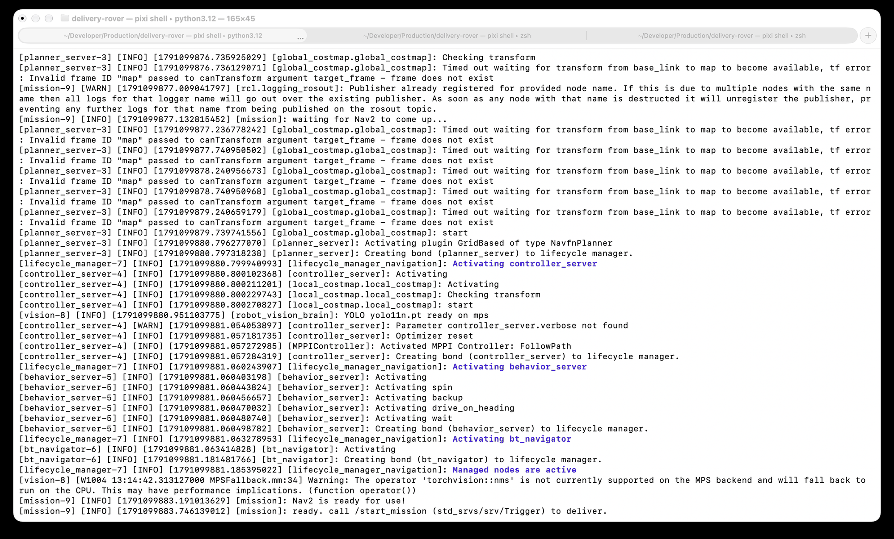
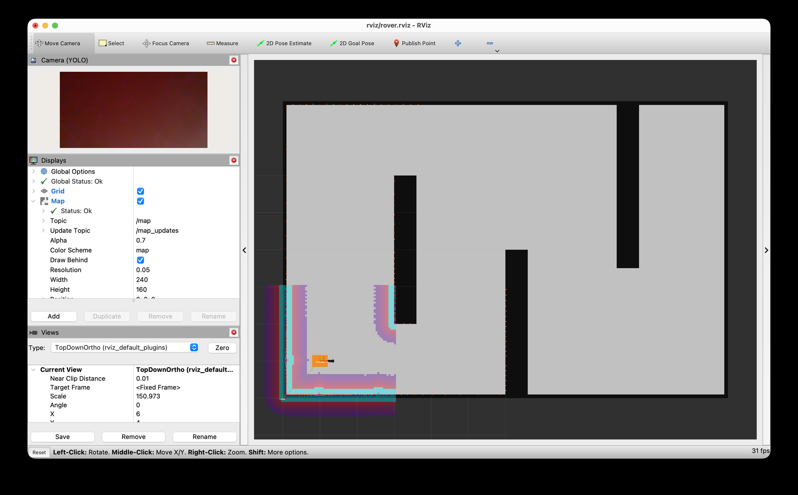
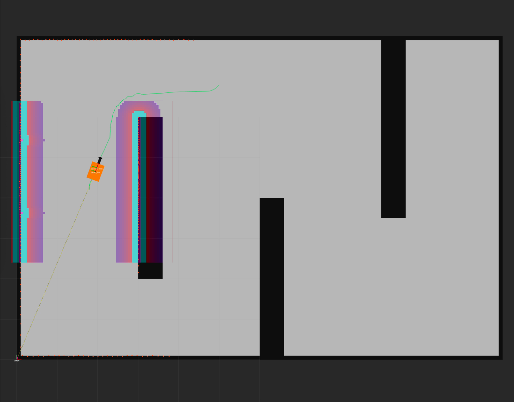
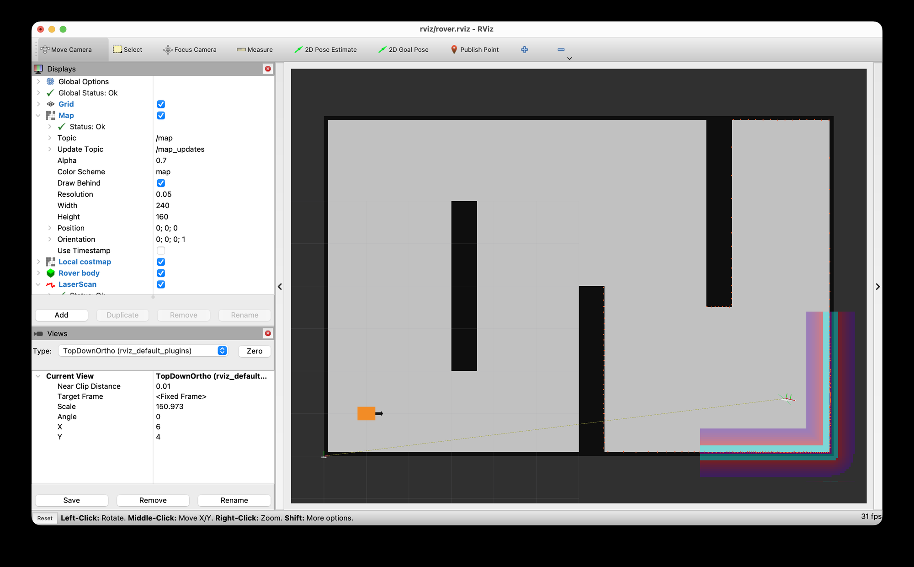
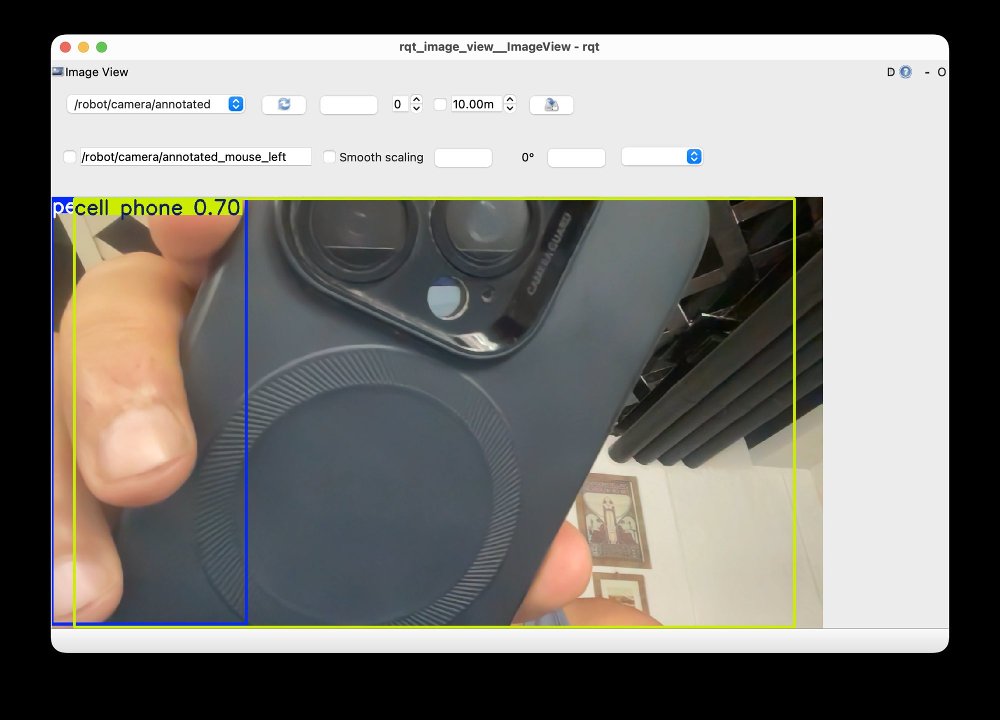
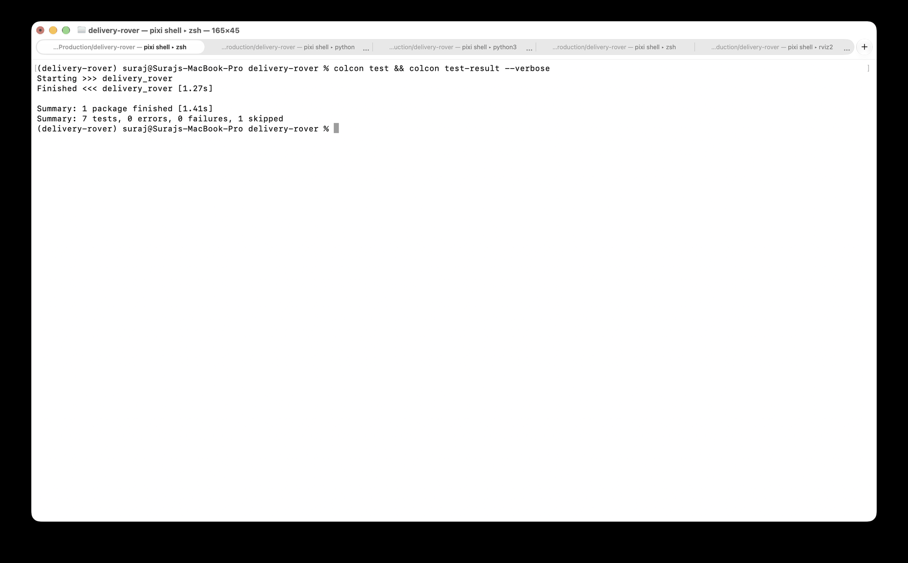
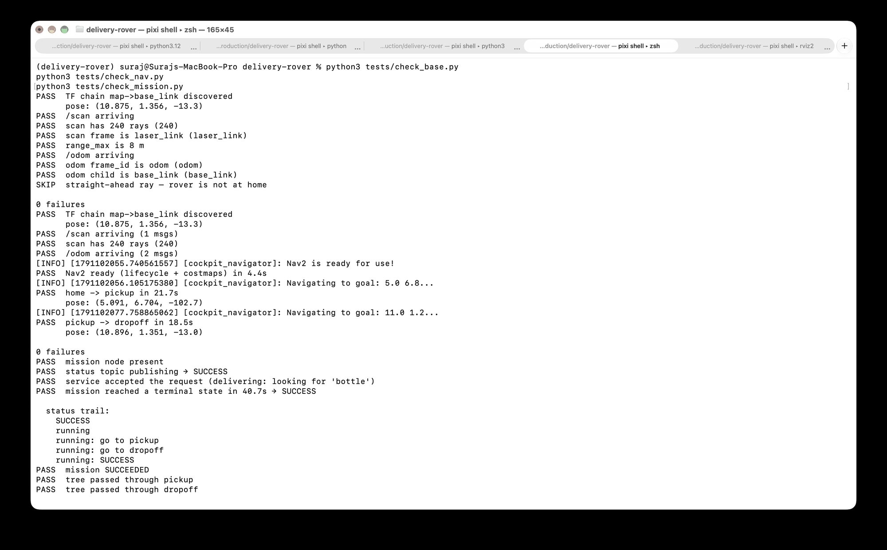
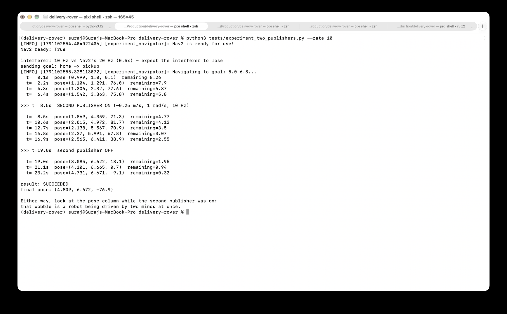

# Intelligent Delivery Rover

An autonomous warehouse delivery robot in ROS 2 Humble. It drives itself across a
depot, uses a camera to confirm the cargo is where it should be, and recovers on
its own when it isn't.

Nine processes, one launch command, one service call.

```bash
ros2 launch delivery_rover bringup.launch.py
ros2 service call /start_mission std_srvs/srv/Trigger '{}'
```



*One unedited run at 3× speed: plan, drive to pickup, fail to find the cargo,
turn and look again, then carry on to dropoff. The cargo is revealed 36 seconds
in, so the failure and the recovery are real, not staged.
([full-speed video](docs/media/mission.mp4))*

---

## What it does

The rover is given one instruction — *deliver* — and works out the rest:

1. Plans a route from **home** to the **pickup** bay, around the shelving.
2. Looks for the cargo with a camera running YOLO.
3. If it sees the cargo, carries on to the **dropoff** point.
4. If it doesn't, it says so, turns in place, and looks again.
5. If it still can't see it, it fails cleanly and reports why — it never hangs.

Throughout, it publishes what it is doing on `/mission/status`, so anything
— a dashboard, a fleet manager, a test script — can follow along without
reaching inside the robot.

## Architecture

```
          /start_mission (std_srvs/Trigger)
                     │
             ┌───────▼────────┐   the only component that reads perception
             │   /mission     │   AND commands navigation — a py_trees
             │  behavior tree │   behavior tree ticking at 2 Hz
             └───┬────────┬───┘
   detections    │        │   NavigateToPose action
 ┌───────────────▼─┐   ┌──▼──────────────────────────┐
 │ /robot_vision_  │   │ Nav2 — 6 lifecycle processes│
 │     brain       │   │ map · planner · controller  │
 │ camera → YOLO   │   │ behavior · BT · lifecycle   │
 └─────────────────┘   └──────────────┬──────────────┘
                                      │ /cmd_vel @ 20 Hz
                        ┌─────────────▼──────────────┐
                        │     /diff_drive_sim        │
                        │ the base and lidar, stood  │
                        │ in for by a kinematic sim  │
                        └──────────────┬─────────────┘
                                       │ /odom · /scan · TF
                                       └──► back to Nav2
```

**Perception and navigation never talk to each other.** YOLO publishes labels;
Nav2 consumes coordinates. The behavior tree is the only bridge — which is where
all of the decision-making in this project actually lives.

**The robot is coupled to its hardware by exactly four names:** `/cmd_vel`,
`/odom`, `/scan`, and TF. Replace the simulator with a real base publishing
those four, and nothing else in the stack changes. That claim is not a diagram —
it is what the base node reports about itself:



*One subscription in, four topics out. Everything else listed is the parameter
and logging boilerplate every ROS 2 node carries.*

| Component | What it is | Written here? |
|---|---|---|
| `/diff_drive_sim` | Kinematic diff-drive base + ray-cast lidar | Yes |
| `/robot_vision_brain` | Camera → YOLO11n → `Detection2DArray` | Yes |
| `/mission` | py_trees behavior tree + `/start_mission` service | Yes |
| Nav2 | NavFn planner, MPPI controller, recovery behaviours | Configured |
| YOLO, py_trees, tf2 | Libraries | Used |

## Stack

ROS 2 Humble · Nav2 1.1.20 (MPPI) · Ultralytics YOLO11n · py_trees 2.4 ·
Python 3.12 · Pixi/RoboStack · macOS (Apple Silicon)

The environment is pinned to `osx-arm64` and has only ever been run there — see
[what's wrong with it](#whats-wrong-with-it) before trying it on Linux.

## Quickstart

```bash
git clone https://github.com/<you>/delivery-rover.git
cd delivery-rover
pixi install && pixi shell

colcon build --symlink-install
source install/setup.zsh          # setup.bash on Linux

ros2 run delivery_rover make_map src/delivery_rover/config/map   # once
colcon build --symlink-install

ros2 launch delivery_rover bringup.launch.py
```

In a second terminal:

```bash
ros2 service call /start_mission std_srvs/srv/Trigger '{}'
ros2 topic echo /mission/status
```

No webcam? Build a test feed from the sample images that ship with
`ultralytics`, and point the vision node at it:

```bash
python3 tests/make_feed.py
ros2 launch delivery_rover bringup.launch.py source:=assets/feed.mp4 cargo:=person
```

### Launch arguments

| Argument | Default | Use |
|---|---|---|
| `perception` | `true` | `false` to run navigation alone |
| `mission` | `true` | `false` to drive it yourself |
| `cargo` | `bottle` | any COCO class the camera can see |
| `source` | `0` | camera index, or a path to a video file |
| `auto_start` | `false` | `true` to deliver as soon as Nav2 is ready |
| `viz` | `false` | `true` starts rosbridge for Foxglove |

## Watching it run

One command brings up nine processes and walks Nav2's five lifecycle servers to
ACTIVE:



*The end of startup: the lifecycle manager activating each server in turn, MPPI
coming up as the controller plugin, YOLO loading onto the Mac's GPU, and the
mission node reporting that it is ready for a goal. The MPS fallback warning for
`torchvision::nms` is expected — that one operator has no Metal kernel and runs
on the CPU.*

`rviz/rover.rviz` is configured to open on the depot with everything already
wired — map, both costmaps, the laser, the global plan, the rover body and the
annotated camera feed:



The rover is the orange box with a nose arrow. There is no URDF in this project,
so that body is a `visualization_msgs/Marker` published once in `base_link` with
`frame_locked` set — RViz re-transforms it through TF every frame, so it follows
the robot without the simulator republishing anything.



*Driving the first leg. Green is the global plan from NavFn; the coloured band
is the local costmap's inflation layer around the shelving, which is what stops
MPPI cutting the corner.*



*Mission complete. Laser returns (red) pick out the two walls of the corner, and
the body sits inside its own costmap footprint.*

Perception is a separate node that only ever publishes labels and boxes:



*`/robot/camera/annotated` in `rqt_image_view`. The mission tree never sees this
image — it subscribes to `/robot/ai/detections`, which carries the class name and
a score and nothing else.*

## Tests

Unit tests for pure logic, integration checks against a running system — the
same split used in industry.

```bash
colcon test && colcon test-result --verbose    # lint + unit tests
```



*Seven tests, no failures. The skip is `test_copyright`, which ament generates
disabled; the rest are flake8, pep257 and the world-geometry unit tests.*

With the stack already running, each check subscribes like any other ROS client
— no privileged access, so anything it can verify, a reviewer can too:

| Check | Verifies |
|---|---|
| `tests/check_base.py` | TF chain, scan geometry, odometry frames |
| `tests/check_nav.py` | Nav2 reaches ready, then drives both legs |
| `tests/check_perception.py` | Detections arrive, images valid, staleness expires |
| `tests/check_mission.py` | Full delivery end to end, with the status trail |



*All three in one pass. `check_nav` drives both legs itself — 21.7 s to pickup,
18.5 s to dropoff — and `check_mission` asserts on the status trail, not just the
final result, so a tree that reached SUCCESS without visiting pickup would fail.*

Two scripts make the awkward cases repeatable:

```bash
# cargo never appears → clean failure, not a hang
python3 tests/fake_perception.py --label ""

# cargo revealed mid-recovery → the rover turns, looks again, and delivers
python3 tests/fake_perception.py --label bottle --delay 36

# what happens when two things command /cmd_vel at once
python3 tests/experiment_two_publishers.py --rate 10   # slower than Nav2
python3 tests/experiment_two_publishers.py             # 40 Hz, faster
```

### The /cmd_vel experiment

A topic has **no arbitration**. Every message is delivered and the robot acts on
whichever arrived last, so the winner is decided by publish rate, not by
priority. Nav2's controller publishes at 20 Hz:



*A 10 Hz interferer loses 1:2 — and the goal still **succeeds**. Watch the
heading column from the moment the second publisher comes on: 71° → 82° → 71° →
68° → 39°, wobbling hard, while `remaining` keeps falling the whole time.
Nothing errors and nothing warns.*

That is the result worth keeping, because **"it still arrived" is exactly how
this bug survives code review on a real robot.** The goal succeeded, the logs
were clean, and the rover was being driven by two minds for fifteen seconds.

Pass `--rate 40` and the interferer outpaces the controller instead; the script
prints the ratio and which way to expect it to go before it sends the goal. Send
the rover home between runs — starting at the goal makes Nav2 return SUCCEEDED
before the interferer does anything, which proves nothing.

## Design decisions worth defending

**A kinematic simulator, not a physics engine.** Nav2 consumes topics, not
physics. Modelling mass and friction would have cost days and changed nothing
about what the stack had to get right.

**`ACTIVE` is not the same as ready.** Every Nav2 server reporting ACTIVE still
isn't enough — a goal sent before the costmaps have digested their first scan
dies with *"plan has 0 poses"*. `navigator.py` waits for both costmap topics as
well. This is the single most useful line in the file.

**Inference runs on a worker thread, and catches everything.** The ROS timer
grabs a frame and returns immediately; a worker runs YOLO. An unhandled
exception there would kill the thread and leave the node *alive but
permanently silent* — the worst failure mode in the system — so it logs and
carries on.

**Detections expire.** `max_age` is what makes "I saw it" mean "I see it".
Without it a crashed vision node leaves its last message in the mission's memory
forever, and the robot keeps believing it can see cargo that isn't there.

**One commander on `/cmd_vel`.** Topics are many-to-many with no arbitration.
Nav2 already has four publishers on that topic — the controller plus three
recovery behaviours — and it is safe only because its behavior tree guarantees
one is active at a time. Arbitration by sequencing, not by transport.

## MPPI tuning

Starting from the Nav2 reference config, the settings that mattered:

| Parameter | Value | Why |
|---|---|---|
| `batch_size` | 2000 | Trajectories sampled per cycle. Halve it on a weak CPU — below ~1000 the paths get visibly worse |
| `time_steps` × `model_dt` | 56 × 0.05 s | A 2.8 s lookahead — enough to commit to going around a shelf rather than stopping at it |
| `vx_max` / `wz_max` | 0.5 m/s · 1.9 rad/s | Warehouse-appropriate; higher and the arcs clip shelving |
| `PathAlignCritic` | 14.0 | Highest weight in the set. Lower it and the rover cuts corners into the inflation layer |
| `PreferForwardCritic` | 5.0 | Stops it reversing out of situations a turn would solve |
| `temperature` | 0.3 | Lower is greedier. Raising it made the path wander without avoiding anything new |

*"Control loop missed its desired rate"* means the CPU lost the 20 Hz loop, not
that the configuration is wrong. Reduce `batch_size` first.

## Repository layout

```
src/delivery_rover/        the robot — everything here is installed
  delivery_rover/          nodes and their libraries
  launch/                  robot · navigation · perception · bringup
  config/                  nav2_params.yaml + the generated map
  test/                    lint + unit tests
tests/                     check scripts — run by hand, never installed
rviz/                      the RViz layout
docs/                      the captured run, and how to reproduce it
```

The split is deliberate: **if it would not be installed on the robot, it does
not belong in the robot's package.** The check scripts talk to the running
system the same way any other ROS client would.

Every image above is reproducible — [`docs/M6-capture-checklist.md`](docs/M6-capture-checklist.md)
gives the exact commands, in order, from a clean checkout.

## What's wrong with it

This is a first robotics project, and it is not a finished product. The
shortcomings below are deliberate and known, not discovered by a reviewer — the
point of listing them is that knowing what a system *doesn't* do is most of
knowing the system. They are the backlog for the next project.

### The simulation hides more than it shows

- **The base is simulated.** The swap to hardware is four topics wide and that
  claim is untested. A real base brings wheel slip, command latency, encoder
  drift and a lidar that misses — none of which this kinematic model produces,
  and all of which change how MPPI behaves.
- **`map → odom` is published as identity**, so there is no localization at all.
  The rover cannot get lost, which conveniently hides the single largest source
  of real-robot failure. AMCL or SLAM belongs here; the consumers wouldn't change,
  but everything downstream would finally be tested against pose error.
- **There is no URDF.** The rover body is a hand-published marker rather than a
  robot description, so there are no joints, no link geometry and no proper
  footprint — Nav2 is working with a radius. A URDF plus `robot_state_publisher`
  is the correct fix and would delete the marker code entirely.
- **No sensor noise anywhere.** The lidar is an exact ray-cast. Adding gaussian
  noise and dropout would be a one-afternoon change and would probably expose
  costmap tuning that is currently getting away with being lucky.

### What the robot genuinely cannot do

- **Detection gives presence, not position.** `Detection2DArray` carries a class
  and a score; nothing projects the box into `base_link`. So the rover can prove
  the cargo is *in view*, never that it is *reachable*, and it cannot drive to the
  cargo — only to a waypoint where the cargo is expected. Closing that gap needs
  depth, camera intrinsics and a TF from the optical frame, and is the single
  biggest capability missing.
- **The waypoints are hardcoded** as a dict literal in `world.py`. Changing where
  the rover delivers means editing source and rebuilding. They should be a YAML
  parameter file loaded at launch.
- **One robot, one mission.** There is no queue, no fleet, no mission beyond the
  two-leg one that is compiled in.

### What isn't tested

- **There is no CI.** No `.github/`, nothing automated. Every result in this
  README was produced by hand, which means nothing stops a regression; the
  `frame_locked` bug below survived exactly because nothing re-checks the visual
  output.
- **Unit coverage is thin.** `colcon test` runs flake8, pep257, a skipped
  copyright check, and one real unit-test module (`test_world.py`). The behaviour
  tree, the navigator's readiness logic and detection staleness are only ever
  exercised by the integration checks, which need a live stack and a human to run
  them.
- **The environment is `osx-arm64` only.** `pixi.toml` pins that one platform and
  the lockfile contains no `linux-64` entries, so `pixi install` will refuse on
  Linux despite ROS 2 being perfectly happy there. Adding the platform to the
  manifest and re-solving is the fix; it has not been done or tested.

### Bugs that cost the most time, and why

Kept because they are the actual lesson of the project: in ROS, the expensive
failures are the silent ones.

| What happened | Why it was expensive |
|---|---|
| RViz showed no laser | `/scan` publishes Best-Effort; the config asked for Reliable. Incompatible QoS means DDS never connects the two — **no error, no warning**, just nothing |
| The rover body never moved | `Marker.frame_locked` defaults to false, so RViz placed it once and left it. Invisible while the robot sat at home; only caught by reviewing screenshots |
| `source:=0` crashed the vision node | Launch arguments are strings, but `launch_ros` writes them into a YAML params file that re-types them, so `0` arrived as INTEGER. Every earlier test passed a file path, which is a string either way |
| `/mission` appeared twice | `Node(name=...)` in a launch file becomes `__node:=`, which remaps **every** node that process creates — including the navigator's internal one |
| Detection ran at 0.35 Hz | YOLO was being handed full 1080p frames. `imgsz=640` fixed it; the model was trained at 640 and the extra pixels bought nothing |
| The `/cmd_vel` experiment "proved" the wrong thing | The first run reported the goal failing permanently. It hadn't — the rig was CPU-starved and the result was measuring the laptop, not the robot. A demo that confirms your argument deserves more suspicion than one that doesn't |

### Next project

Hardware base, real localization, a URDF, depth-projected detections, and CI
that runs the integration checks against a headless stack on every push.

## License

MIT for everything in this repository — see [`LICENSE`](LICENSE).

One caveat worth stating plainly: the detector depends on **Ultralytics YOLO,
which is AGPL-3.0**, as are the `*.pt` weights it downloads at runtime. Neither
is vendored here, and the MIT licence above covers only this repository's own
source. [`THIRD-PARTY-NOTICES.md`](THIRD-PARTY-NOTICES.md) lists every
dependency licence and explains what that means if you want to reuse this.
